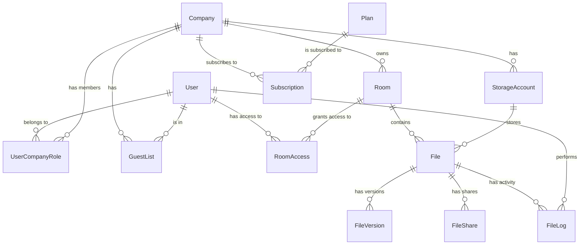

# Database Schema Design

## 1. Overview

This document outlines the complete database schema for the file transfer application, including entity relationships, table structures, indexes, and constraints. The schema is designed to support user management, file operations, storage provider integration, and real-time collaboration.

## 2. Entity Relationship Diagram



## 3. Core Tables

### Users Table

```sql
CREATE TABLE users (
  id VARCHAR(36) PRIMARY KEY,
  email VARCHAR(255) NOT NULL UNIQUE,
  first_name VARCHAR(100) NOT NULL,
  last_name VARCHAR(100) NOT NULL,
  profile_picture VARCHAR(255),
  auth0_id VARCHAR(255) UNIQUE,
  user_type ENUM('b2c', 'b2b') NOT NULL DEFAULT 'b2c',
  is_active BOOLEAN NOT NULL DEFAULT TRUE,
  is_verified BOOLEAN NOT NULL DEFAULT FALSE,
  created_at TIMESTAMP NOT NULL DEFAULT CURRENT_TIMESTAMP,
  updated_at TIMESTAMP NOT NULL DEFAULT CURRENT_TIMESTAMP ON UPDATE CURRENT_TIMESTAMP,
  INDEX idx_email (email),
  INDEX idx_auth0_id (auth0_id)
);
```

### Companies Table

```sql
CREATE TABLE companies (
  id VARCHAR(36) PRIMARY KEY,
  name VARCHAR(255) NOT NULL,
  email VARCHAR(255) NOT NULL,
  logo VARCHAR(255),
  is_active BOOLEAN NOT NULL DEFAULT TRUE,
  created_at TIMESTAMP NOT NULL DEFAULT CURRENT_TIMESTAMP,
  updated_at TIMESTAMP NOT NULL DEFAULT CURRENT_TIMESTAMP ON UPDATE CURRENT_TIMESTAMP,
  INDEX idx_name (name)
);

CREATE TABLE company_settings (
  company_id VARCHAR(36) PRIMARY KEY,
  track_downloads BOOLEAN NOT NULL DEFAULT TRUE,
  max_file_size BIGINT NOT NULL DEFAULT 10737418240, -- 10GB default
  max_user_count INT NOT NULL DEFAULT 10,
  room_limit INT NOT NULL DEFAULT 5,
  default_storage_id VARCHAR(36),
  settings JSON NOT NULL,
  created_at TIMESTAMP NOT NULL DEFAULT CURRENT_TIMESTAMP,
  updated_at TIMESTAMP NOT NULL DEFAULT CURRENT_TIMESTAMP ON UPDATE CURRENT_TIMESTAMP,
  FOREIGN KEY (company_id) REFERENCES companies(id) ON DELETE CASCADE
);
```

### User-Company Relationships

```sql
CREATE TABLE user_company_roles (
  id VARCHAR(36) PRIMARY KEY,
  user_id VARCHAR(36) NOT NULL,
  company_id VARCHAR(36) NOT NULL,
  role VARCHAR(50) NOT NULL, -- admin, member, etc.
  joined_at TIMESTAMP NOT NULL DEFAULT CURRENT_TIMESTAMP,
  updated_at TIMESTAMP NOT NULL DEFAULT CURRENT_TIMESTAMP ON UPDATE CURRENT_TIMESTAMP,
  FOREIGN KEY (user_id) REFERENCES users(id) ON DELETE CASCADE,
  FOREIGN KEY (company_id) REFERENCES companies(id) ON DELETE CASCADE,
  UNIQUE KEY unq_user_company (user_id, company_id),
  INDEX idx_company_users (company_id, user_id)
);
```

### Rooms Table

```sql
CREATE TABLE rooms (
  id VARCHAR(36) PRIMARY KEY,
  name VARCHAR(255) NOT NULL,
  company_id VARCHAR(36) NOT NULL,
  created_by_id VARCHAR(36) NOT NULL,
  room_type ENUM('vault', 'p2p') NOT NULL,
  access_level ENUM('private', 'company', 'guests') NOT NULL DEFAULT 'private',
  user_limit INT NOT NULL DEFAULT 10,
  file_size_limit BIGINT NOT NULL DEFAULT 5368709120, -- 5GB
  file_expiry_days INT NOT NULL DEFAULT 7,
  is_locked BOOLEAN NOT NULL DEFAULT FALSE,
  is_active BOOLEAN NOT NULL DEFAULT TRUE,
  created_at TIMESTAMP NOT NULL DEFAULT CURRENT_TIMESTAMP,
  updated_at TIMESTAMP NOT NULL DEFAULT CURRENT_TIMESTAMP ON UPDATE CURRENT_TIMESTAMP,
  FOREIGN KEY (company_id) REFERENCES companies(id) ON DELETE CASCADE,
  FOREIGN KEY (created_by_id) REFERENCES users(id) ON DELETE CASCADE,
  INDEX idx_company_rooms (company_id),
  INDEX idx_room_type (room_type)
);
```

### Room Access Table

```sql
CREATE TABLE room_access (
  id VARCHAR(36) PRIMARY KEY,
  room_id VARCHAR(36) NOT NULL,
  user_id VARCHAR(36) NOT NULL,
  access_type VARCHAR(50) NOT NULL, -- owner, editor, viewer
  invited_by_id VARCHAR(36),
  invited_at TIMESTAMP NOT NULL DEFAULT CURRENT_TIMESTAMP,
  updated_at TIMESTAMP NOT NULL DEFAULT CURRENT_TIMESTAMP ON UPDATE CURRENT_TIMESTAMP,
  FOREIGN KEY (room_id) REFERENCES rooms(id) ON DELETE CASCADE,
  FOREIGN KEY (user_id) REFERENCES users(id) ON DELETE CASCADE,
  FOREIGN KEY (invited_by_id) REFERENCES users(id) ON DELETE SET NULL,
  UNIQUE KEY unq_room_user (room_id, user_id),
  INDEX idx_user_rooms (user_id)
);
```

### Storage Accounts Table

```sql
CREATE TABLE storage_accounts (
  id VARCHAR(36) PRIMARY KEY,
  name VARCHAR(255) NOT NULL,
  company_id VARCHAR(36) NOT NULL,
  storage_type ENUM('vault', 's3', 'google_drive', 'dropbox', 'azure_blob', 'onedrive', 'gcp_storage') NOT NULL,
  is_default BOOLEAN NOT NULL DEFAULT FALSE,
  created_at TIMESTAMP NOT NULL DEFAULT CURRENT_TIMESTAMP,
  updated_at TIMESTAMP NOT NULL DEFAULT CURRENT_TIMESTAMP ON UPDATE CURRENT_TIMESTAMP,
  FOREIGN KEY (company_id) REFERENCES companies(id) ON DELETE CASCADE,
  INDEX idx_company_storage (company_id)
);

CREATE TABLE storage_credentials (
  storage_id VARCHAR(36) PRIMARY KEY,
  credentials TEXT NOT NULL, -- Encrypted credentials
  expires_at TIMESTAMP NULL,
  updated_at TIMESTAMP NOT NULL DEFAULT CURRENT_TIMESTAMP ON UPDATE CURRENT_TIMESTAMP,
  FOREIGN KEY (storage_id) REFERENCES storage_accounts(id) ON DELETE CASCADE
);

CREATE TABLE storage_stats (
  storage_id VARCHAR(36) PRIMARY KEY,
  total_size BIGINT NOT NULL DEFAULT 0,
  used_size BIGINT NOT NULL DEFAULT 0,
  file_count INT NOT NULL DEFAULT 0,
  last_updated TIMESTAMP NOT NULL DEFAULT CURRENT_TIMESTAMP ON UPDATE CURRENT_TIMESTAMP,
  FOREIGN KEY (storage_id) REFERENCES storage_accounts(id) ON DELETE CASCADE
);
```

### Files Table

```sql
CREATE TABLE files (
  id VARCHAR(36) PRIMARY KEY,
  name VARCHAR(255) NOT NULL,
  original_name VARCHAR(255) NOT NULL,
  mime_type VARCHAR(255),
  size BIGINT NOT NULL DEFAULT 0,
  file_type ENUM('file', 'folder') NOT NULL,
  parent_id VARCHAR(36),
  storage_id VARCHAR(36) NOT NULL,
  room_id VARCHAR(36) NOT NULL,
  uploaded_by_id VARCHAR(36) NOT NULL,
  storage_key VARCHAR(255),
  encryption ENUM('none', 'client_side', 'server_side') NOT NULL DEFAULT 'none',
  encryption_key_id VARCHAR(255),
  metadata JSON,
  delete_after TIMESTAMP NULL,
  is_deleted BOOLEAN NOT NULL DEFAULT FALSE,
  created_at TIMESTAMP NOT NULL DEFAULT CURRENT_TIMESTAMP,
  updated_at TIMESTAMP NOT NULL DEFAULT CURRENT_TIMESTAMP ON UPDATE CURRENT_TIMESTAMP,
  FOREIGN KEY (parent_id) REFERENCES files(id) ON DELETE CASCADE,
  FOREIGN KEY (storage_id) REFERENCES storage_accounts(id) ON DELETE CASCADE,
  FOREIGN KEY (room_id) REFERENCES rooms(id) ON DELETE CASCADE,
  FOREIGN KEY (uploaded_by_id) REFERENCES users(id) ON DELETE CASCADE,
  INDEX idx_room_files (room_id),
  INDEX idx_parent_files (parent_id),
  INDEX idx_storage_files (storage_id),
  INDEX idx_name (name),
  INDEX idx_delete_after (delete_after)
);
```

### File Versions Table

```sql
CREATE TABLE file_versions (
  id VARCHAR(36) PRIMARY KEY,
  file_id VARCHAR(36) NOT NULL,
  version_number INT NOT NULL,
  size BIGINT NOT NULL,
  storage_key VARCHAR(255) NOT NULL,
  uploaded_by_id VARCHAR(36) NOT NULL,
  encryption_key_id VARCHAR(255),
  created_at TIMESTAMP NOT NULL DEFAULT CURRENT_TIMESTAMP,
  FOREIGN KEY (file_id) REFERENCES files(id) ON DELETE CASCADE,
  FOREIGN KEY (uploaded_by_id) REFERENCES users(id) ON DELETE CASCADE,
  UNIQUE KEY unq_file_version (file_id, version_number),
  INDEX idx_file_versions (file_id)
);
```

### File Sharing Table

```sql
CREATE TABLE file_shares (
  id VARCHAR(36) PRIMARY KEY,
  file_id VARCHAR(36) NOT NULL,
  created_by_id VARCHAR(36) NOT NULL,
  access_token VARCHAR(255) NOT NULL UNIQUE,
  expires_at TIMESTAMP NULL,
  max_downloads INT NULL,
  download_count INT NOT NULL DEFAULT 0,
  created_at TIMESTAMP NOT NULL DEFAULT CURRENT_TIMESTAMP,
  FOREIGN KEY (file_id) REFERENCES files(id) ON DELETE CASCADE,
  FOREIGN KEY (created_by_id) REFERENCES users(id) ON DELETE CASCADE,
  INDEX idx_access_token (access_token),
  INDEX idx_expires_at (expires_at)
);
```

### File Activity Logs

```sql
CREATE TABLE file_logs (
  id VARCHAR(36) PRIMARY KEY,
  file_id VARCHAR(36) NOT NULL,
  user_id VARCHAR(36) NOT NULL,
  action VARCHAR(50) NOT NULL, -- download, view, share, delete
  metadata JSON,
  created_at TIMESTAMP NOT NULL DEFAULT CURRENT_TIMESTAMP,
  FOREIGN KEY (file_id) REFERENCES files(id) ON DELETE CASCADE,
  FOREIGN KEY (user_id) REFERENCES users(id) ON DELETE CASCADE,
  INDEX idx_file_actions (file_id, action),
  INDEX idx_user_actions (user_id, action)
);
```

### Subscription Tables

```sql
CREATE TABLE plans (
  id VARCHAR(36) PRIMARY KEY,
  name VARCHAR(255) NOT NULL,
  plan_type ENUM('free', 'standard', 'premium', 'enterprise') NOT NULL,
  price DECIMAL(10, 2) NOT NULL,
  billing_cycle ENUM('monthly', 'annual') NOT NULL,
  max_users INT NOT NULL,
  max_storage BIGINT NOT NULL,
  max_rooms INT NOT NULL,
  features JSON NOT NULL,
  is_active BOOLEAN NOT NULL DEFAULT TRUE,
  created_at TIMESTAMP NOT NULL DEFAULT CURRENT_TIMESTAMP,
  updated_at TIMESTAMP NOT NULL DEFAULT CURRENT_TIMESTAMP ON UPDATE CURRENT_TIMESTAMP
);

CREATE TABLE subscriptions (
  id VARCHAR(36) PRIMARY KEY,
  company_id VARCHAR(36) NOT NULL,
  plan_id VARCHAR(36) NOT NULL,
  status ENUM('active', 'trialing', 'past_due', 'canceled', 'unpaid') NOT NULL,
  start_date TIMESTAMP NOT NULL,
  end_date TIMESTAMP NULL,
  canceled_at TIMESTAMP NULL,
  payment_provider_id VARCHAR(255),
  created_at TIMESTAMP NOT NULL DEFAULT CURRENT_TIMESTAMP,
  updated_at TIMESTAMP NOT NULL DEFAULT CURRENT_TIMESTAMP ON UPDATE CURRENT_TIMESTAMP,
  FOREIGN KEY (company_id) REFERENCES companies(id) ON DELETE CASCADE,
  FOREIGN KEY (plan_id) REFERENCES plans(id),
  INDEX idx_company_subscription (company_id),
  INDEX idx_status (status)
);
```

### Guest Access Table

```sql
CREATE TABLE guest_lists (
  id VARCHAR(36) PRIMARY KEY,
  company_id VARCHAR(36) NOT NULL,
  user_id VARCHAR(36) NOT NULL,
  added_by_id VARCHAR(36) NOT NULL,
  added_at TIMESTAMP NOT NULL DEFAULT CURRENT_TIMESTAMP,
  updated_at TIMESTAMP NOT NULL DEFAULT CURRENT_TIMESTAMP ON UPDATE CURRENT_TIMESTAMP,
  FOREIGN KEY (company_id) REFERENCES companies(id) ON DELETE CASCADE,
  FOREIGN KEY (user_id) REFERENCES users(id) ON DELETE CASCADE,
  FOREIGN KEY (added_by_id) REFERENCES users(id) ON DELETE CASCADE,
  UNIQUE KEY unq_company_guest (company_id, user_id),
  INDEX idx_company_guests (company_id)
);
```

## 4. Search Optimization Tables

```sql
CREATE TABLE file_search_index (
  file_id VARCHAR(36) PRIMARY KEY,
  file_name VARCHAR(255) NOT NULL,
  mime_type VARCHAR(100),
  file_size BIGINT,
  created_by_id VARCHAR(36),
  company_id VARCHAR(36),
  room_id VARCHAR(36),
  tags JSON,
  updated_at TIMESTAMP NOT NULL,
  FOREIGN KEY (file_id) REFERENCES files(id) ON DELETE CASCADE,
  FOREIGN KEY (created_by_id) REFERENCES users(id) ON DELETE CASCADE,
  FOREIGN KEY (company_id) REFERENCES companies(id) ON DELETE CASCADE,
  FOREIGN KEY (room_id) REFERENCES rooms(id) ON DELETE CASCADE,
  INDEX idx_name_search (file_name),
  INDEX idx_mime_type (mime_type),
  INDEX idx_created_by (created_by_id),
  INDEX idx_company_files (company_id),
  INDEX idx_room_files_search (room_id),
  INDEX idx_updated_at (updated_at),
  FULLTEXT INDEX ft_name_tags (file_name, tags)
);
```

## 5. Indexes and Performance Considerations

### Primary Keys
- All tables use UUIDs (VARCHAR(36)) as primary keys for scalability and security
- Provides better data distribution across partitions
- Allows for client-side ID generation

### Foreign Keys
- All relationships enforced with foreign key constraints
- DELETE CASCADE used selectively where appropriate
- Parent deletions handled through application logic where complex conditions exist

### Indexing Strategy
- Indexes on all frequently queried columns
- Composite indexes for common query combinations
- Full-text indexes for search functionality
- Selective indexing to balance query performance versus write overhead

### Temporal Data
- Created/updated timestamps on all records
- Expiry times for temporary resources (file shares, invitations)
- Soft deletes implemented for recoverable data

## 6. Data Validation Rules

### Users
- Email must be unique and valid format
- Auth0ID unique when present
- User must have first and last name

### Files
- Files must have name and size
- Files must belong to a room and storage account
- Folders can contain other files/folders (self-referencing)
- Encryption keys tracked when encryption enabled

### Storage
- Each company can have multiple storage accounts
- One storage account can be designated as default
- Credentials stored encrypted
- Storage accounts support multiple types (Wasabi, S3, etc.)

### Rooms
- Rooms have access controls via room_access table
- Rooms belong to a company
- File size and user limits set at room level
- Expiry policies configured at room level

## 7. Schema Evolution

### Migration Strategy
- Use Drizzle ORM for schema management
- Versioned migrations for schema changes
- Support for rollback migrations
- Data migration plans for schema changes

### Backward Compatibility
- Schema changes maintain backward compatibility where possible
- Field additions use sensible defaults
- Avoid destructive changes to critical tables
- Use temporary tables for complex migrations

## 8. Performance Optimizations

### Denormalization Strategies
- Store computed values where beneficial for read performance
- Cache frequently accessed data in Redis
- Use materialized views for complex reports

### Partitioning Strategy
- Files table partitioned by creation date for large deployments
- Activity logs partitioned by month
- Consider horizontal sharding for multi-tenant scenarios

## 9. Security Considerations

### Data Protection
- Credentials and sensitive data stored encrypted
- Personal information minimized
- Access controls enforced at database level

### Audit Trail
- All critical actions logged with user context
- File access tracked for compliance
- Immutable history for security-relevant changes