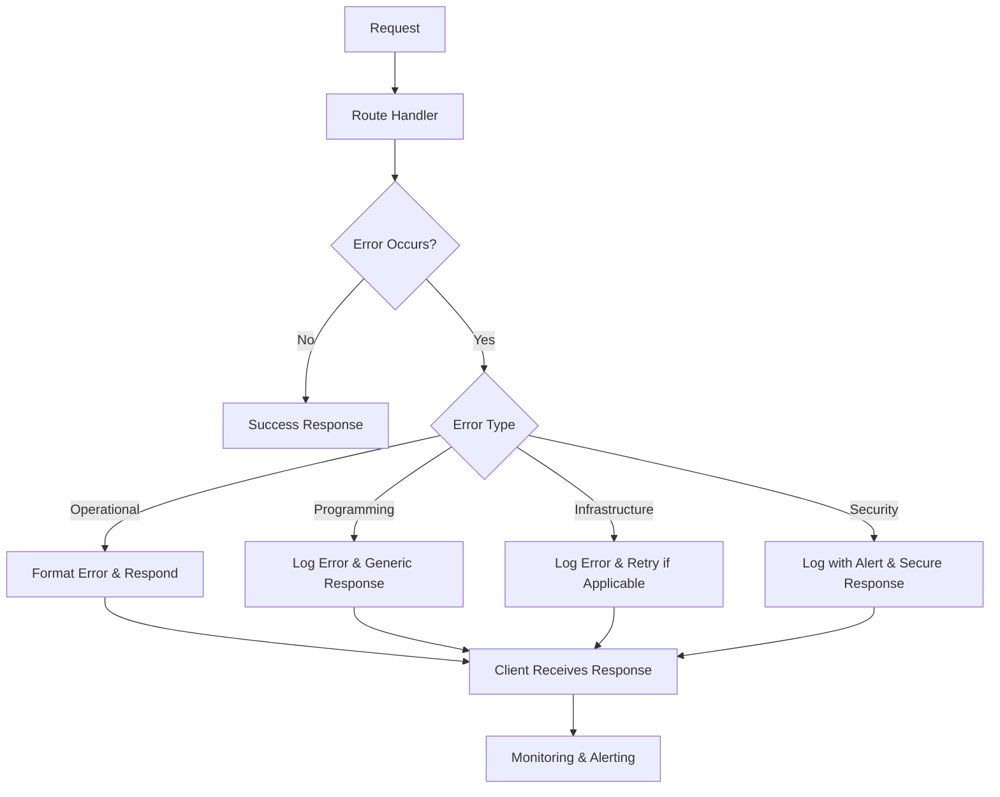

# Error Handling and Logging Strategy

## Overview

This document outlines the comprehensive error handling and logging strategy for the file transfer application. A robust error handling and logging system is critical for maintaining application reliability, security, and observability, especially for an application handling sensitive file transfers and storage operations.

## 1. Error Handling Architecture

### Error Classification

We classify errors into the following categories to ensure appropriate handling and response:

1. **Operational Errors**
   - Expected errors during normal operation
   - Examples: File not found, validation errors, authentication failures
   - Handled gracefully with proper user feedback

2. **Programming Errors**
   - Bugs or unexpected conditions
   - Examples: Null pointer exceptions, type errors, unhandled edge cases
   - Logged thoroughly for debugging, generic error shown to user

3. **Infrastructure Errors**
   - System-level failures
   - Examples: Database connection failures, third-party API timeouts
   - Logged with high priority, retry mechanisms where appropriate

4. **Security Incidents**
   - Security-related errors
   - Examples: Authentication bypass attempts, injection attacks
   - Logged securely with alerts, appropriate responses to prevent information leakage

### Error Handling Flow



## 2. Standardized Error Types

### Base Error Class

```typescript
/**
 * Base application error class
 */
export class AppError extends Error {
  constructor(
    public readonly message: string,
    public readonly statusCode: number = 500,
    public readonly code: string = 'INTERNAL_ERROR',
    public readonly details?: any,
    public readonly isOperational: boolean = true,
  ) {
    super(message);
    this.name = this.constructor.name;
    Error.captureStackTrace(this, this.constructor);
  }
}
```

### Error Hierarchy

```
AppError (Base class)
├── ValidationError (400)
├── AuthenticationError (401)
├── AuthorizationError (403)
├── NotFoundError (404)
├── ConflictError (409)
├── RateLimitError (429)
├── StorageError (500)
│   ├── StorageConnectionError
│   ├── StorageQuotaError
│   └── FileProcessingError
├── DatabaseError (500)
├── ThirdPartyServiceError (502)
└── ConfigurationError (500)
```

### Error Codes and Status Mapping

| Error Type | Error Code | HTTP Status | Description |
|------------|------------|-------------|-------------|
| `ValidationError` | `VALIDATION_ERROR` | 400 | Invalid input data |
| `AuthenticationError` | `UNAUTHORIZED` | 401 | Missing or invalid authentication |
| `AuthorizationError` | `FORBIDDEN` | 403 | Insufficient permissions |
| `NotFoundError` | `NOT_FOUND` | 404 | Resource not found |
| `ConflictError` | `CONFLICT` | 409 | Resource conflict or already exists |
| `RateLimitError` | `RATE_LIMIT_EXCEEDED` | 429 | Too many requests |
| `StorageError` | `STORAGE_ERROR` | 500 | Storage operation failure |
| `DatabaseError` | `DATABASE_ERROR` | 500 | Database operation failure |
| `ThirdPartyServiceError` | `SERVICE_UNAVAILABLE` | 502 | External service failure |
| `ConfigurationError` | `CONFIGURATION_ERROR` | 500 | System misconfiguration |

### Error Type Implementations

```typescript
// Specific error implementations
export class ValidationError extends AppError {
  constructor(message: string, details?: any) {
    super(message, 400, 'VALIDATION_ERROR', details, true);
  }
}

export class AuthenticationError extends AppError {
  constructor(message: string = 'Authentication required') {
    super(message, 401, 'UNAUTHORIZED', undefined, true);
  }
}

export class AuthorizationError extends AppError {
  constructor(message: string = 'Insufficient permissions') {
    super(message, 403, 'FORBIDDEN', undefined, true);
  }
}

export class NotFoundError extends AppError {
  constructor(resource: string, id?: string) {
    const message = id 
      ? `${resource} not found with id: ${id}` 
      : `${resource} not found`;
    super(message, 404, 'NOT_FOUND', { resource, id }, true);
  }
}

export class ConflictError extends AppError {
  constructor(message: string, details?: any) {
    super(message, 409, 'CONFLICT', details, true);
  }
}

export class RateLimitError extends AppError {
  constructor(message: string = 'Rate limit exceeded', details?: any) {
    super(message, 429, 'RATE_LIMIT_EXCEEDED', details, true);
  }
}

export class StorageError extends AppError {
  constructor(message: string, details?: any) {
    super(message, 500, 'STORAGE_ERROR', details, true);
  }
}

export class DatabaseError extends AppError {
  constructor(message: string, details?: any) {
    super(message, 500, 'DATABASE_ERROR', details, true);
  }
}

export class ThirdPartyServiceError extends AppError {
  constructor(service: string, message: string, details?: any) {
    super(
      `Error with ${service}: ${message}`, 
      502, 
      'SERVICE_UNAVAILABLE', 
      details, 
      true
    );
  }
}

export class ConfigurationError extends AppError {
  constructor(message: string, details?: any) {
    super(message, 500, 'CONFIGURATION_ERROR', details, false);
  }
}
```

## 3. Error Handling Middleware

### Error Handler Middleware

```typescript
// Global error handling middleware
export const errorHandler: ErrorRequestHandler = (
  err: Error | AppError,
  req: Request,
  res: Response,
  next: NextFunction
): void => {
  // Default error values
  let statusCode = 500;
  let errorCode = 'INTERNAL_ERROR';
  let message = 'An unexpected error occurred';
  let details: any = undefined;
  let isOperational = false;

  // Get request ID for tracking
  const requestId = req.headers['x-request-id'] || uuidv4();

  // Handle AppError instances
  if (err instanceof AppError) {
    statusCode = err.statusCode;
    errorCode = err.code;
    message = err.message;
    details = err.details;
    isOperational = err.isOperational;
  } 
  // Handle known Express/Node errors
  else if (err.name === 'SyntaxError') {
    statusCode = 400;
    errorCode = 'INVALID_JSON';
    message = 'Invalid JSON payload';
    isOperational = true;
  } 
  else if (err.name === 'UnauthorizedError') {
    statusCode = 401;
    errorCode = 'UNAUTHORIZED';
    message = 'Invalid token';
    isOperational = true;
  }

  // Determine log level based on error status
  const logLevel = statusCode >= 500 ? 'error' : 'warn';

  // Create structured log
  const logData = {
    requestId,
    errorName: err.name,
    errorCode,
    message: err.message,
    statusCode,
    stackTrace: err.stack,
    isOperational,
    path: req.path,
    method: req.method,
    ip: req.ip,
    userId: req.user?.id,
  };

  // Log error with appropriate level
  if (logLevel === 'error') {
    logger.error('Request error', logData);
  } else {
    logger.warn('Request warning', logData);
  }

  // Only expose error details in non-production environments
  // if details exist and it's safe to show them
  const responseDetails = 
    process.env.NODE_ENV !== 'production' && isOperational
      ? details
      : undefined;

  // Send error response
  res.status(statusCode).json({
    success: false,
    error: {
      code: errorCode,
      message,
      details: responseDetails,
      requestId
    }
  });
};
```

### Error Handler Registration

```typescript
// Register error handling middleware in Express app
const app = express();

// ... other middleware and routes

// 404 handler - must come after all defined routes
app.use((req, res, next) => {
  next(new NotFoundError('Route', req.path));
});

// Global error handler - must be the last middleware
app.use(errorHandler);
```

## 4. Service-Level Error Handling Pattern

### Error Handling in Services

```typescript
// Example error handling pattern in a service method
class FileServiceImpl implements FileService {
  async getFile(fileId: string): Promise<File> {
    try {
      // Validate input
      if (!fileId) {
        throw new ValidationError('File ID is required');
      }
      
      // Try to get from cache
      const cachedFile = await this.cacheService.getCachedFile(fileId);
      if (cachedFile) return cachedFile;
      
      // Get from database
      const file = await this.fileRepository.findById(fileId);
      
      // Throw not found error if file doesn't exist
      if (!file) {
        throw new NotFoundError('File', fileId);
      }
      
      // Cache and return the file
      await this.cacheService.cacheFile(fileId, file);
      return file;
    } catch (error) {
      // Rethrow application errors as-is
      if (error instanceof AppError) {
        throw error;
      }
      
      // Convert database errors
      if (error.name === 'SequelizeConnectionError') {
        throw new DatabaseError(`Database connection error: ${error.message}`, {
          originalError: error.message,
          fileId
        });
      }
      
      // Convert other unknown errors
      this.logger.error('Unexpected error in getFile', {
        fileId,
        error: error.message,
        stack: error.stack
      });
      
      throw new AppError(
        'An error occurred while retrieving the file',
        500,
        'FILE_RETRIEVAL_ERROR',
        { fileId, originalError: error.message },
        false
      );
    }
  }
}
```

### Asynchronous Error Handling

```typescript
// Higher-order function for async route handler error catching
const asyncHandler = (fn: RequestHandler): RequestHandler => {
  return (req, res, next) => {
    Promise.resolve(fn(req, res, next)).catch(next);
  };
};

// Usage in route definitions
router.get('/files/:id', asyncHandler(async (req, res) => {
  const fileId = req.params.id;
  const file = await fileService.getFile(fileId);
  res.json({ success: true, data: file });
}));
```

## 5. Logging Strategy

### Logging Levels

The application uses the following logging levels, in order of increasing severity:

1. **debug**: Detailed debugging information
2. **info**: Noteworthy events in normal operation
3. **warn**: Potentially problematic situations that don't cause errors
4. **error**: Error events that might still allow the application to continue
5. **fatal**: Severe errors that cause the application to terminate

### Structured Logging Format

All logs are in JSON format with the following standardized fields:

```typescript
interface LogEntry {
  timestamp: string;        // ISO 8601 format
  level: string;            // debug, info, warn, error, fatal
  message: string;          // Brief, human-readable description
  context?: string;         // Application context (e.g., "file-service")
  requestId?: string;       // For request correlation
  userId?: string;          // For user correlation
  resourceType?: string;    // Type of resource (file, room, etc.)
  resourceId?: string;      // ID of resource involved
  duration?: number;        // Operation duration in ms (for performance logs)
  metadata?: object;        // Additional structured data
  error?: {                 // Present for error logs
    name: string;
    message: string;
    code?: string;
    stack?: string;
  };
}
```

### Logger Implementation

```typescript
// Logger service implementation
import winston from 'winston';
import { v4 as uuidv4 } from 'uuid';

// Define log levels and colors
const levels = {
  debug: 0,
  info: 1,
  warn: 2,
  error: 3,
  fatal: 4,
};

const colors = {
  debug: 'blue',
  info: 'green',
  warn: 'yellow',
  error: 'red',
  fatal: 'magenta',
};

// Create Winston logger
export const createLogger = (context: string) => {
  const logger = winston.createLogger({
    levels,
    level: process.env.LOG_LEVEL || 'info',
    format: winston.format.combine(
      winston.format.timestamp(),
      winston.format.errors({ stack: true }),
      winston.format.json()
    ),
    defaultMeta: { context },
    transports: [
      // Console transport for development
      ...(process.env.NODE_ENV !== 'production'
        ? [
            new winston.transports.Console({
              format: winston.format.combine(
                winston.format.colorize({ colors }),
                winston.format.simple()
              ),
            }),
          ]
        : []),
      // File transport for production
      ...(process.env.NODE_ENV === 'production'
        ? [
            new winston.transports.File({
              filename: 'logs/error.log',
              level: 'error',
            }),
            new winston.transports.File({ filename: 'logs/combined.log' }),
          ]
        : []),
    ],
  });

  // Add AWS CloudWatch or other transports for production
  if (process.env.NODE_ENV === 'production') {
    if (process.env.CLOUDWATCH_ENABLED === 'true') {
      // AWS CloudWatch transport would be added here
    }
    
    if (process.env.ELASTIC_LOGGING_ENABLED === 'true') {
      // Elasticsearch transport would be added here
    }
  }

  // Create request-scoped logger
  const createRequestLogger = (requestId: string, userId?: string) => {
    return {
      debug: (message: string, meta: object = {}) => {
        logger.debug(message, { ...meta, requestId, userId });
      },
      info: (message: string, meta: object = {}) => {
        logger.info(message, { ...meta, requestId, userId });
      },
      warn: (message: string, meta: object = {}) => {
        logger.warn(message, { ...meta, requestId, userId });
      },
      error: (message: string, meta: object = {}) => {
        logger.error(message, { ...meta, requestId, userId });
      },
      fatal: (message: string, meta: object = {}) => {
        logger.log('fatal', message, { ...meta, requestId, userId });
      },
    };
  };

  return {
    debug: (message: string, meta: object = {}) => {
      logger.debug(message, meta);
    },
    info: (message: string, meta: object = {}) => {
      logger.info(message, meta);
    },
    warn: (message: string, meta: object = {}) => {
      logger.warn(message, meta);
    },
    error: (message: string, meta: object = {}) => {
      logger.error(message, meta);
    },
    fatal: (message: string, meta: object = {}) => {
      logger.log('fatal', message, meta);
    },
    createRequestLogger,
  };
};
```

### Request Logging Middleware

```typescript
// Request logging middleware
export const requestLogger: RequestHandler = (req, res, next) => {
  // Generate request ID if not present
  const requestId = req.headers['x-request-id'] as string || uuidv4();
  res.setHeader('X-Request-ID', requestId);
  
  // Get user ID if available
  const userId = req.user?.id;
  
  // Create request-scoped logger
  const requestLogger = logger.createRequestLogger(requestId, userId);
  
  // Attach logger to request
  req.logger = requestLogger;
  
  // Log request start
  const startTime = Date.now();
  requestLogger.info('Request started', {
    method: req.method,
    url: req.url,
    ip: req.ip,
    userAgent: req.headers['user-agent'],
  });
  
  // Log request completion
  res.on('finish', () => {
    const duration = Date.now() - startTime;
    const level = res.statusCode >= 500 ? 'error' : 
                  res.statusCode >= 400 ? 'warn' : 'info';
    
    requestLogger[level]('Request completed', {
      method: req.method,
      url: req.url,
      statusCode: res.statusCode,
      duration,
      responseSize: parseInt(res.getHeader('Content-Length') as string, 10) || 0,
    });
  });
  
  next();
};
```

## 6. Audit Logging

### Security and Compliance Logging

For security-sensitive operations and data access, we implement specialized audit logging:

```typescript
// Audit logger implementation
export const auditLogger = createLogger('audit');

// Example audit log function
export const logAuditEvent = (
  userId: string,
  action: string,
  resource: string,
  resourceId: string,
  details?: any,
  success: boolean = true
) => {
  auditLogger.info(`Audit: ${action}`, {
    userId,
    action,
    resource,
    resourceId,
    success,
    details,
    timestamp: new Date().toISOString(),
  });
};

// Usage examples
// File access
logAuditEvent(
  user.id,
  'file_access',
  'file',
  fileId,
  { ip: req.ip, method: 'download' },
  true
);

// Authentication
logAuditEvent(
  user.id,
  'login',
  'user',
  user.id,
  { ip: req.ip, userAgent: req.headers['user-agent'] },
  true
);

// Permission change
logAuditEvent(
  adminUser.id,
  'permission_change',
  'user',
  targetUser.id,
  { 
    oldRole: 'member', 
    newRole: 'admin', 
    companyId: company.id 
  },
  true
);
```

### Sensitive Data Handling

```typescript
// Sensitive data sanitization for logs
const sanitizeData = (data: any): any => {
  if (!data) return data;
  
  // Clone data to avoid modifying original
  const sanitized = { ...data };
  
  // List of keys to sanitize
  const sensitiveKeys = [
    'password', 'token', 'secret', 'key', 'credentials', 
    'accessKey', 'privateKey', 'apiKey', 'jwt', 'refreshToken'
  ];
  
  // Sanitize keys
  Object.keys(sanitized).forEach(key => {
    const lowerKey = key.toLowerCase();
    
    // Check if current key contains any sensitive keywords
    if (sensitiveKeys.some(sensitive => lowerKey.includes(sensitive))) {
      sanitized[key] = '[REDACTED]';
    } 
    // Recursively sanitize objects
    else if (typeof sanitized[key] === 'object' && sanitized[key] !== null) {
      sanitized[key] = sanitizeData(sanitized[key]);
    }
  });
  
  return sanitized;
};

// Usage when logging
logger.info('User data processed', sanitizeData(userData));
```

## 7. Log Aggregation and Analysis

### Log Collection Architecture

```
┌────────────────┐     ┌────────────────┐     ┌────────────────┐
│                │     │                │     │                │
│  Application   │     │  Application   │     │  Application   │
│  Instance 1    │     │  Instance 2    │     │  Instance N    │
│                │     │                │     │                │
└───────┬────────┘     └───────┬────────┘     └───────┬────────┘
        │                      │                      │
        ▼                      ▼                      ▼
┌─────────────────────────────────────────────────────────────┐
│                                                             │
│                 Fluent Bit / Fluentd Agents                 │
│                                                             │
└───────────────────────────────┬─────────────────────────────┘
                                │
                                ▼
               ┌───────────────────────────────┐
               │                               │
               │     Elasticsearch Cluster     │
               │                               │
               └───────────────┬───────────────┘
                               │
                               ▼
                ┌──────────────────────────────┐
                │                              │
                │         Kibana / Grafana     │
                │                              │
                └──────────────────────────────┘
```

### Log Rotation and Retention

For local file-based logs in development and backup purposes:

```typescript
// Log rotation configuration (using winston-daily-rotate-file)
import 'winston-daily-rotate-file';

const fileRotateTransport = new winston.transports.DailyRotateFile({
  filename: 'logs/application-%DATE%.log',
  datePattern: 'YYYY-MM-DD',
  maxSize: '20m',
  maxFiles: '14d',
  auditFile: 'logs/audit.json',
  zippedArchive: true,
});

// Add to winston configuration
logger.add(fileRotateTransport);
```

### Log Analysis Tools

1. **Kibana Dashboards**
   - Error rate monitoring
   - Request latency tracking
   - User activity analysis
   - Security incident visualization

2. **Alerts Configuration**
   - High error rate alerts
   - Unusual activity detection
   - Performance degradation alerts
   - Security breach notifications

## 8. Error Monitoring and Alerting

### Real-time Error Monitoring

```typescript
// Integration with error monitoring service (e.g., Sentry)
import * as Sentry from '@sentry/node';

// Initialize Sentry
if (process.env.NODE_ENV === 'production') {
  Sentry.init({
    dsn: process.env.SENTRY_DSN,
    environment: process.env.ENVIRONMENT || 'production',
    tracesSampleRate: 0.2,
    integrations: [
      // Enable HTTP calls tracing
      new Sentry.Integrations.Http({ tracing: true }),
      // Enable Express.js middleware tracing
      new Sentry.Integrations.Express({ app }),
    ],
  });
  
  // Add Sentry request handler (must be first middleware)
  app.use(Sentry.Handlers.requestHandler());
  
  // Add Sentry tracing handler
  app.use(Sentry.Handlers.tracingHandler());
}

// Modify error handler to report to Sentry
export const errorHandler: ErrorRequestHandler = (
  err: Error | AppError,
  req: Request,
  res: Response,
  next: NextFunction
): void => {
  // Existing error handler code...
  
  // Report to Sentry if in production and error is not operational
  if (
    process.env.NODE_ENV === 'production' && 
    (!isOperational || statusCode >= 500)
  ) {
    Sentry.withScope((scope) => {
      scope.setTag('requestId', requestId.toString());
      scope.setUser({ id: req.user?.id });
      scope.setLevel(statusCode >= 500 ? Sentry.Severity.Error : Sentry.Severity.Warning);
      
      if (details) {
        scope.setExtras(details);
      }
      
      Sentry.captureException(err);
    });
  }
  
  // Continue with response...
};
```

### Alert Thresholds and Escalation

```typescript
// Example alert thresholds

// 1. Error rate threshold (implemented in monitoring system)
// Alert if more than 5% of requests result in 5xx errors over 5 minutes

// 2. Critical operations monitoring
const monitorCriticalOperation = async (
  operationName: string,
  operationFn: () => Promise<any>
) => {
  const startTime = Date.now();
  try {
    const result = await operationFn();
    const duration = Date.now() - startTime;
    
    // Log successful operation
    logger.info(`${operationName} completed`, { duration });
    
    // Alert on slow operations
    if (duration > getThresholdForOperation(operationName)) {
      alertOnSlowOperation(operationName, duration);
    }
    
    return result;
  } catch (error) {
    const duration = Date.now() - startTime;
    
    // Log failed operation
    logger.error(`${operationName} failed`, { 
      duration,
      error: error.message,
      stack: error.stack
    });
    
    // Alert on critical operation failure
    alertOnFailedOperation(operationName, error);
    
    throw error;
  }
};

// 3. Resource usage monitoring (implemented by infrastructure)
// Alert if memory usage exceeds 85% for more than 10 minutes
// Alert if disk usage exceeds 90%
// Alert if CPU usage exceeds 80% for more than 5 minutes
```

## 9. Error Management Process

### Error Management Workflow

1. **Error Detection**
   - Application logs error
   - Monitoring system detects anomaly
   - User reports issue

2. **Error Triage**
   - Classify error severity
   - Assign ownership
   - Prioritize based on impact

3. **Investigation**
   - Analyze logs and context
   - Reproduce if possible
   - Identify root cause

4. **Resolution**
   - Develop fix
   - Test solution
   - Deploy and verify

5. **Post-mortem**
   - Document incident
   - Implement preventive measures
   - Update monitoring if needed

### Error Tracking System Integration

```typescript
// Error ticket creation integration
interface ErrorTicket {
  id: string;
  title: string;
  description: string;
  severity: 'critical' | 'high' | 'medium' | 'low';
  status: 'new' | 'in_progress' | 'resolved' | 'closed';
  assignee?: string;
  createdAt: Date;
  updatedAt: Date;
}

// Create ticket for critical errors
const createErrorTicket = async (error: AppError, context: any): Promise<ErrorTicket> => {
  // Only create tickets for non-operational errors or high-impact issues
  if (error.isOperational && error.statusCode < 500) {
    return;
  }
  
  // Create ticket in JIRA/GitHub/etc.
  const ticketData = {
    title: `[${error.code}] ${error.message.substring(0, 100)}`,
    description: generateTicketDescription(error, context),
    severity: determineSeverity(error),
    status: 'new',
    createdAt: new Date(),
    updatedAt: new Date()
  };
  
  // Call ticket system API
  // ...
  
  return ticket;
};

// Generate detailed ticket description
const generateTicketDescription = (error: AppError, context: any): string => {
  return `
## Error Details
- **Type**: ${error.name}
- **Code**: ${error.code}
- **Message**: ${error.message}
- **Status Code**: ${error.statusCode}
- **Operational**: ${error.isOperational}
- **Request ID**: ${context.requestId}
- **User ID**: ${context.userId || 'Not authenticated'}
- **Timestamp**: ${new Date().toISOString()}

## Stack Trace
\`\`\`
${error.stack}
\`\`\`

## Context
\`\`\`json
${JSON.stringify(sanitizeData(context), null, 2)}
\`\`\`

## Environment
- **Environment**: ${process.env.NODE_ENV}
- **Version**: ${process.env.APP_VERSION}
- **Node Version**: ${process.version}
  `;
};
```

## 10. Development Practices

### Error Handling Best Practices

1. **Be explicit about error handling**
   - Don't swallow exceptions
   - Always provide context with errors
   - Consider error propagation paths

2. **Use async/await with try/catch**
   - More readable than promise chains
   - Easier to handle errors consistently
   - Makes error flow more explicit

3. **Fail fast, fail loudly**
   - Detect errors early in the process
   - Validate inputs at system boundaries
   - Don't mask or ignore potential issues

4. **Include context in errors**
   - Add relevant data to error objects
   - Use structured error details
   - Make errors actionable for debugging

### Logging Best Practices

1. **Be thoughtful about log levels**
   - Use appropriate level for message importance
   - Don't log sensitive data
   - Consider log volume in production

2. **Structure log messages**
   - Use JSON format for machine processing
   - Include consistent fields across logs
   - Add context where appropriate

3. **Log meaningful events**
   - Business operations completions
   - State transitions
   - Performance measurements
   - Security events

4. **Focus on actionability**
   - Include enough context to troubleshoot
   - Avoid overly verbose or redundant logging
   - Prefer structured data over text messages

## Summary

This error handling and logging strategy provides a comprehensive approach to managing errors and maintaining system observability. By implementing standardized error types, consistent error handling patterns, and structured logging, we create a robust foundation for application reliability and maintainability.

Key benefits of this strategy include:

1. **Improved Developer Experience** through consistent error patterns
2. **Enhanced Reliability** with proper error capture and handling
3. **Better Observability** with structured, correlated logs
4. **Security Compliance** via proper audit logging
5. **Rapid Issue Resolution** through integrated monitoring and alerting

This approach supports the critical requirements of a secure file transfer application, ensuring that errors are properly handled, tracked, and resolved throughout the system lifecycle.