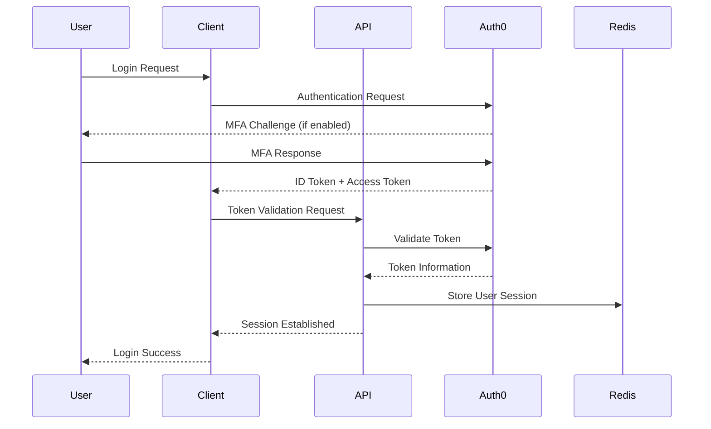
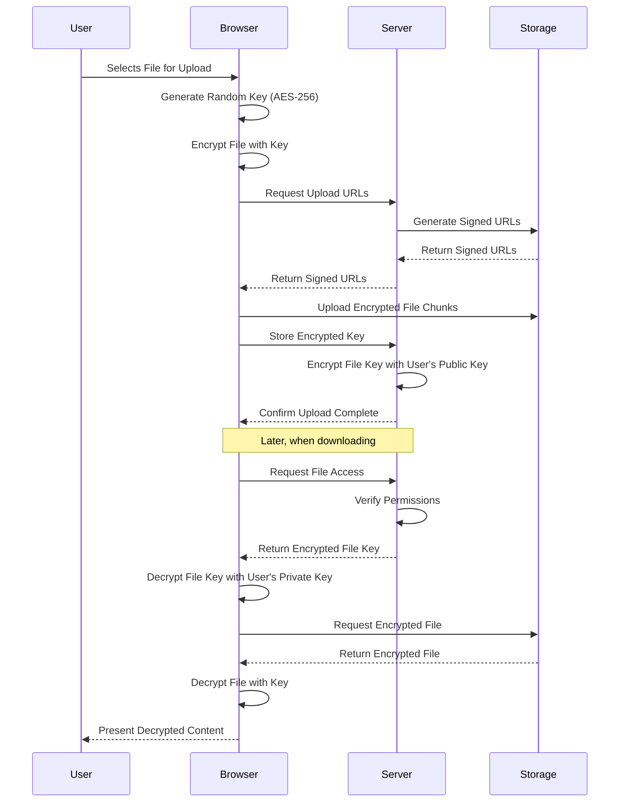
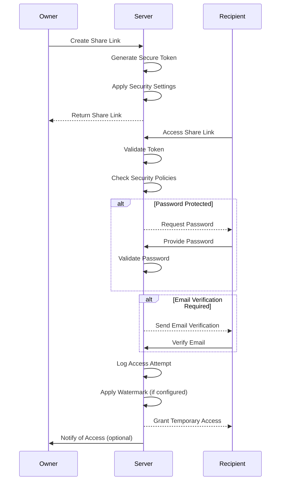

# Security Architecture

## Overview

The security architecture is designed to protect data throughout its lifecycle—at rest, in transit, and during processing. It implements multiple layers of protection, follows the principle of least privilege, and ensures compliance with industry standards and regulations.

## 1. Authentication & Authorization

### Identity Management

- **Auth0 Integration**
  - Single Sign-On (SSO) with multi-factor authentication
  - OIDC-compliant authentication flow
  - Social identity provider integration
  - Enterprise identity federation (SAML, LDAP)

- **Session Management**
  - Short-lived JWT tokens (1 hour expiry)
  - Refresh token rotation
  - Redis-based token blacklisting
  - Session revocation on suspicious activity

- **Multi-factor Authentication (MFA)**
  - Required for administrative actions
  - Optional for regular users
  - Enforced for high-risk operations
  - Backup codes for recovery

### Authorization Model

- **Role-Based Access Control (RBAC)**
  - Company level roles: Owner, Admin, Member, Guest
  - Room level roles: Owner, Editor, Viewer
  - Roles with pre-defined permission sets

- **Attribute-Based Access Control (ABAC)**
  - Dynamic permissions based on resource attributes
  - Time-based access restrictions
  - Location-based access controls (optional)
  - Context-aware authorization decisions

- **Permission Evaluation Flow**

  ```mermaid
  flowchart TD
    A[Request] --> B{Authenticated?}
    B -->|No| C[Reject]
    B -->|Yes| D{Has Role?}
    D -->|No| C
    D -->|Yes| E{Check Permissions}
    E -->|Has Permission| F[Allow]
    E -->|No Permission| G{Check Attributes}
    G -->|Allowed| F
    G -->|Denied| C
  ```

## 2. Data Protection

### Encryption Strategy

- **Data in Transit**
  - TLS 1.2+ for all connections
  - Strong cipher suites (ECDHE-RSA-AES256-GCM-SHA384)
  - HTTP Strict Transport Security (HSTS)
  - Certificate pinning for mobile apps

- **Data at Rest**
  - Client-side encryption (E2EE)
    - AES-256-GCM for file content
    - PBKDF2 for key derivation
    - Argon2 for password hashing
  - Server-side encryption (SSE)
    - Provider-managed encryption (Wasabi/Storj)
    - AWS KMS for key management
    - Envelope encryption for metadata

- **End-to-End Encryption (E2EE) Implementation**
  - Browser-based encryption using Web Crypto API
  - Per-file encryption keys
  - Secure key sharing via asymmetric encryption
  - Zero-knowledge architecture for sensitive files

### Key Management

- **Key Hierarchy**

  ```
  ┌─────────────────────┐
  │ Master Key (AWS KMS)│
  └───────────┬─────────┘
              │
              ▼
  ┌─────────────────────┐
  │ Data Encryption Keys│
  └───────────┬─────────┘
              │
              ▼
  ┌─────────────────────┐
  │ File Encryption Keys│
  └─────────────────────┘
  ```

- **Key Rotation Policies**
  - Master keys: Annual rotation
  - Data encryption keys: Quarterly rotation
  - File keys: Static (new key per file)
  - Credentials: 90-day rotation

- **Key Distribution**
  - Secure key sharing with authorized users
  - Just-in-time key access
  - Key revocation for departed users
  - Secure key backup and recovery

## 3. Infrastructure Security

### Network Security

- **Defense in Depth**
  - Web Application Firewall (WAF)
  - Network ACLs and Security Groups
  - DDoS protection
  - API rate limiting

- **Network Segregation**
  - Public-facing API services in DMZ
  - Database servers in private subnets
  - Micro-segmentation for workloads
  - Egress filtering

- **Secure Communication**
  - Internal service mesh with mTLS
  - VPC peering for cross-region communication
  - Encrypted service-to-service communication
  - Bastion hosts for administrative access

### Cloud Security

- **Infrastructure as Code (IaC)**
  - Immutable infrastructure pattern
  - Version-controlled infrastructure
  - Automated security validation
  - Least privilege service accounts

- **Secrets Management**
  - Vault for secrets storage
  - Dynamic secrets for infrastructure
  - Automated secret rotation
  - Access audit logging

- **Container Security**
  - Minimal base images
  - Image vulnerability scanning
  - Runtime protection
  - Resource isolation

## 4. Application Security

### Secure Development Practices

- **Secure SDLC**
  - Security requirements in design phase
  - Threat modeling for new features
  - Security code reviews
  - Regular security training

- **Code Security**
  - Static application security testing (SAST)
  - Software composition analysis (SCA)
  - Dynamic application security testing (DAST)
  - Interactive application security testing (IAST)

- **API Security**
  - Input validation and sanitization
  - Output encoding
  - Content Security Policy (CSP)
  - API schema validation

### Common Vulnerabilities Protection

- **OWASP Top 10 Mitigations**
  - SQL Injection: Parameterized queries, ORM
  - Broken Authentication: Multi-factor, rate limiting
  - Sensitive Data Exposure: Encryption, data classification
  - XML External Entities: Safe parsers, schema validation
  - Broken Access Control: RBAC, policy enforcement
  - Security Misconfiguration: Hardened defaults, scanning
  - Cross-Site Scripting: CSP, output encoding
  - Insecure Deserialization: Validated schemas, whitelisting
  - Known Vulnerabilities: Dependency scanning, patching
  - Insufficient Logging: Comprehensive audit trails

## 5. Operational Security

### Security Monitoring

- **Comprehensive Logging**
  - Authentication events
  - Authorization decisions
  - Data access audit trail
  - Administrative actions
  - System events

- **Security Information and Event Management (SIEM)**
  - Real-time alert correlation
  - Anomaly detection
  - Security dashboards
  - Automated response playbooks

- **Threat Detection**
  - Behavior analytics
  - Account takeover detection
  - Data exfiltration monitoring
  - Unusual access patterns

### Incident Response

- **Incident Response Plan**
  - Defined roles and responsibilities
  - Escalation procedures
  - Communication templates
  - Recovery processes

- **Playbooks**
  - Account compromise response
  - Data breach containment
  - Ransomware mitigation
  - DDoS response

- **Post-Incident Analysis**
  - Root cause analysis
  - Lessons learned documentation
  - Process improvements
  - Security control updates

## 6. Compliance and Governance

### Data Governance

- **Data Classification**
  - Public, Internal, Confidential, Restricted
  - Automated data classification
  - Data handling policies
  - Access controls based on classification

- **Data Lifecycle Management**
  - Data retention policies
  - Secure data deletion
  - Version control and archiving
  - Legal hold process

- **Privacy Controls**
  - Data minimization
  - Purpose limitation
  - User consent management
  - Data subject rights automation

### Compliance Frameworks

- **Industry Standards**
  - SOC 2 Type II
  - ISO 27001
  - NIST Cybersecurity Framework
  - GDPR, CCPA compliance

- **Controls Mapping**
  - Mapped controls to compliance requirements
  - Control effectiveness monitoring
  - Gap assessments
  - Continuous compliance validation

## 7. File Sharing Security

### Secure File Sharing

- **External Sharing Controls**
  - Password-protected shares
  - Expiry dates for shared links
  - Download limits
  - Viewer-only access options

- **Watermarking and Tracking**
  - Dynamic document watermarking
  - Access logging for shared files
  - IP-based access restrictions
  - Email verification for recipients

- **Data Loss Prevention (DLP)**
  - Content scanning for sensitive data
  - Sharing policy enforcement
  - Automated classification
  - Blocking of unauthorized sharing

## 8. Security Implementation Examples

### User Authentication Flow



### End-to-End Encryption Process



### File Sharing Security Flow



## 9. Security Roadmap

### Short-term (0-6 months)
- Implement Auth0 integration with MFA
- Set up base encryption for data at rest
- Deploy WAF and basic security monitoring
- Establish incident response procedures

### Medium-term (6-12 months)
- Implement end-to-end encryption
- Deploy advanced threat detection
- Complete SOC 2 certification
- Enhance DLP capabilities

### Long-term (12-24 months)
- Implement zero-trust architecture
- Add advanced behavioral analytics
- Achieve ISO 27001 certification
- Deploy advanced SIEM capabilities

## 10. Security Considerations for High-Risk Operations

### Critical Access Requirements

| Operation | Authentication | Authorization | Monitoring |
|-----------|---------------|---------------|------------|
| Admin Access | MFA + IP Restriction | Owner/Admin Role | Real-time Alerts |
| Key Management | MFA + Device Trust | Owner Role | Detailed Audit |
| Bulk Data Export | MFA | Admin Role | DLP Monitoring |
| Security Settings | MFA | Owner Role | Configuration Change Alerting |
| User Management | MFA | Admin Role | User Change Monitoring |

This comprehensive security architecture provides defense in depth for the application, ensuring data protection at all stages while maintaining usability and compliance with industry standards.