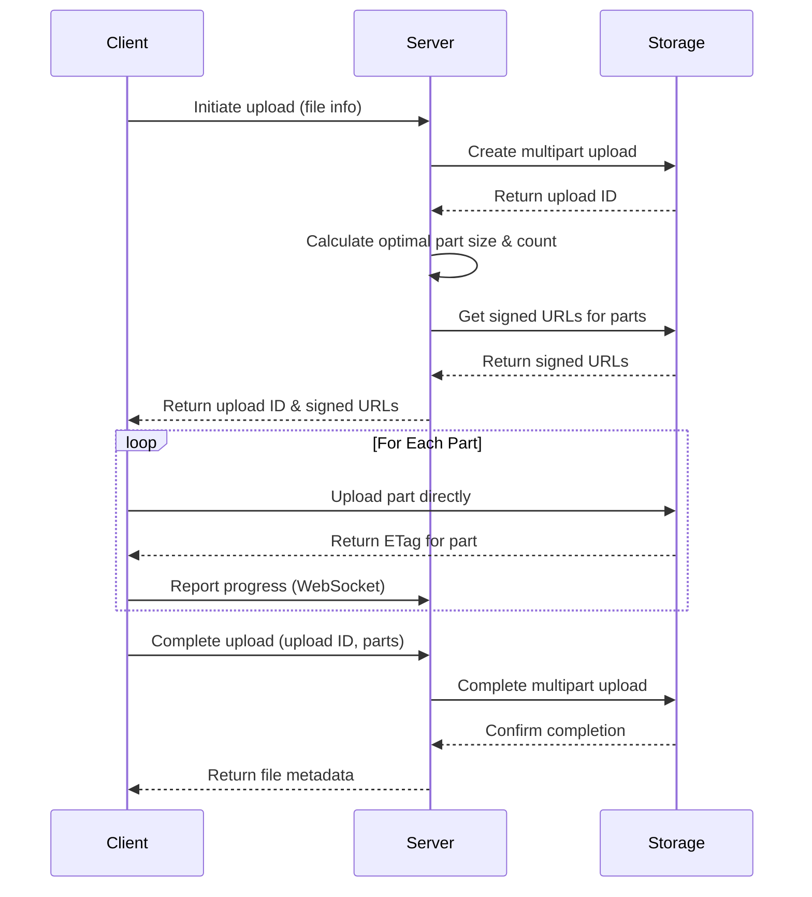

# Storage Provider Framework Technical Specification

## 1. Component Overview

### Purpose
The Storage Provider Framework serves as an abstraction layer for various cloud storage services, allowing the application to interact with different storage providers through a unified interface. This enables flexibility in storage options, migration between providers, and support for both centralized and decentralized storage solutions.

### Key Operations
- File upload (both direct and multipart)
- File download
- File deletion
- Folder creation and management
- File metadata retrieval
- Access control (pre-signed URLs)
- Storage statistics and monitoring

### Primary Storage Providers
1. **Wasabi** (Primary Centralized Storage)
   - S3-compatible object storage
   - Lower cost than traditional cloud storage
   - Hot storage optimized for frequent access

2. **Storj** (Primary Decentralized Storage)
   - Web3 decentralized storage network
   - End-to-end encryption
   - Distributed architecture for resilience

### Additional Supported Providers
1. **AWS S3** - Amazon's object storage service
2. **Google Drive** - Google's file storage and synchronization service
3. **Dropbox** - Cloud file hosting service
4. **Microsoft Azure Blob Storage** - Microsoft's object storage solution
5. **Microsoft OneDrive** - Microsoft's file hosting service
6. **Google Cloud Storage** - Google's object storage for large unstructured data
7. **Generic S3-Compatible Storage** - Support for any S3-compatible storage provider

## 2. Interface Design

### Core Storage Provider Interface

```typescript
/**
 * Interface for all storage provider operations
 */
export interface StorageProvider {
  /**
   * Initialize the storage provider with credentials
   * @param credentials Provider-specific credentials
   * @returns Operation result
   */
  initialize(credentials: any): Promise<StorageOperationResult>;
  
  /**
   * Test the connection to the storage provider
   * @returns Operation result indicating connection status
   */
  testConnection(): Promise<StorageOperationResult>;
  
  /**
   * Generate a signed URL for direct client operations
   * @param key Object key or path
   * @param options Options including operation type, expiry time, etc.
   * @returns Operation result with signed URL if successful
   */
  getSignedUrl(key: string, options: SignedUrlOptions): Promise<StorageOperationResult & { url?: string }>;
  
  /**
   * Create a folder in the storage
   * @param path Parent path
   * @param folderName Name of the new folder
   * @param options Additional options
   * @returns Operation result with folder metadata
   */
  createFolder(path: string, folderName: string, options?: FolderOptions): Promise<StorageOperationResult>;
  
  /**
   * List files in a directory
   * @param path Directory path
   * @param options Listing options (recursive, pagination, etc.)
   * @returns Operation result with file list
   */
  listFiles(path: string, options?: ListOptions): Promise<StorageOperationResult & { files?: FileMetadata[] }>;
  
  /**
   * Get metadata for a file
   * @param key Object key or path
   * @returns Operation result with file metadata
   */
  getFileMetadata(key: string): Promise<StorageOperationResult & { metadata?: FileMetadata }>;
  
  /**
   * Delete a file or folder
   * @param key Object key or path
   * @param options Deletion options
   * @returns Operation result
   */
  deleteFile(key: string, options?: DeleteOptions): Promise<StorageOperationResult>;
  
  /**
   * Check if a file exists
   * @param key Object key or path
   * @returns Operation result with existence flag
   */
  fileExists(key: string): Promise<StorageOperationResult & { exists?: boolean }>;
  
  /**
   * Create a multipart upload session for large files
   * @param key Object key or path
   * @param options Upload options
   * @returns Operation result with upload ID and part information
   */
  createMultipartUpload(key: string, options?: UploadOptions): Promise<StorageOperationResult & { uploadId?: string }>;
  
  /**
   * Get signed URL for uploading a specific part
   * @param key Object key or path
   * @param uploadId Multipart upload ID
   * @param partNumber Part number
   * @param contentLength Expected content length
   * @returns Operation result with signed URL for part upload
   */
  getSignedUrlForPart(key: string, uploadId: string, partNumber: number, contentLength: number): Promise<StorageOperationResult & { url?: string }>;
  
  /**
   * Complete a multipart upload
   * @param key Object key or path
   * @param uploadId Multipart upload ID
   * @param parts Information about uploaded parts
   * @returns Operation result
   */
  completeMultipartUpload(key: string, uploadId: string, parts: any[]): Promise<StorageOperationResult>;
  
  /**
   * Abort a multipart upload
   * @param key Object key or path
   * @param uploadId Multipart upload ID
   * @returns Operation result
   */
  abortMultipartUpload(key: string, uploadId: string): Promise<StorageOperationResult>;
  
  /**
   * Get provider capabilities and limitations
   * @returns Provider capabilities object
   */
  getCapabilities(): StorageProviderCapabilities;
  
  /**
   * Get storage usage statistics
   * @returns Operation result with storage statistics
   */
  getStorageStats(): Promise<StorageOperationResult & { stats?: StorageStats }>;
}
```

### Supporting Types

```typescript
/**
 * Common response interface for all storage operations
 */
export interface StorageOperationResult {
  success: boolean;
  message?: string;
  data?: Record<string, any>;
  error?: Error;
}

/**
 * Options for generating signed URLs
 */
export interface SignedUrlOptions {
  operation: 'read' | 'write' | 'delete';
  expiresIn: number; // Seconds
  contentType?: string;
  metadata?: Record<string, string>;
  maxSizeBytes?: number;
  fileName?: string;
  contentDisposition?: string;
}

/**
 * Options for file uploads
 */
export interface UploadOptions {
  contentType?: string;
  contentDisposition?: string;
  metadata?: Record<string, string>;
  expiresAt?: Date;
  encryptionKey?: string;
  mimeType?: string;
  cacheControl?: string;
  tagging?: Record<string, string>;
}

/**
 * Options for folder creation
 */
export interface FolderOptions {
  metadata?: Record<string, string>;
  public?: boolean;
}

/**
 * Options for listing files
 */
export interface ListOptions {
  recursive?: boolean;
  maxResults?: number;
  prefix?: string;
  delimiter?: string;
  pageToken?: string;
  includeMetadata?: boolean;
  sortBy?: 'name' | 'size' | 'lastModified';
  sortDirection?: 'asc' | 'desc';
}

/**
 * Options for file deletion
 */
export interface DeleteOptions {
  recursive?: boolean;
  permanent?: boolean;
  versionId?: string;
}

/**
 * File metadata interface
 */
export interface FileMetadata {
  key: string;
  name: string;
  size: number;
  lastModified?: Date;
  contentType?: string;
  isDirectory?: boolean;
  metadata?: Record<string, string>;
  etag?: string;
  versionId?: string;
  checksum?: string;
  url?: string;
  permissions?: string[];
  owner?: string;
  tags?: Record<string, string>;
}

/**
 * Storage provider capabilities and limitations
 */
export interface StorageProviderCapabilities {
  supportsMultipartUpload: boolean;
  supportsRangeRequests: boolean;
  supportsServerSideEncryption: boolean;
  supportsVersioning: boolean;
  supportsFolderCreation: boolean;
  supportsTags: boolean;
  supportsMetadata: boolean;
  maximumFileSize: number; // bytes, 0 for unlimited
  maximumPartSize: number; // bytes, for multipart uploads
  minimumPartSize: number; // bytes, for multipart uploads
  maximumPartCount: number; // maximum number of parts in multipart upload
  validContentTypes?: string[]; // null/undefined for all
}

/**
 * Storage usage statistics
 */
export interface StorageStats {
  totalBytes: number;
  usedBytes: number;
  availableBytes: number;
  fileCount: number;
  lastUpdated: Date;
  usageByType?: Record<string, number>; // Bytes used by file type
  costEstimate?: number; // Estimated cost in USD
}
```

### Storage Provider Factory

```typescript
/**
 * Factory for creating storage provider instances
 */
export interface StorageProviderFactory {
  /**
   * Create a storage provider instance
   * @param type Storage provider type
   * @param credentials Provider-specific credentials
   * @returns StorageProvider instance or null if type is not supported
   */
  createProvider(type: StorageProviderType, credentials?: any): StorageProvider | null;
  
  /**
   * Get available provider types
   * @returns List of supported provider types
   */
  getAvailableProviders(): StorageProviderType[];
  
  /**
   * Register a new provider implementation
   * @param type Provider type
   * @param providerClass Provider implementation class
   */
  registerProvider(type: StorageProviderType, providerClass: new () => StorageProvider): void;
}

/**
 * Storage provider types
 */
export type StorageProviderType = 
  | 'wasabi'
  | 'storj'
  | 'aws-s3'
  | 'google-drive'
  | 'dropbox'
  | 'azure-blob'
  | 'onedrive'
  | 'gcp-storage'
  | 's3-compatible';
```

## 3. Provider-Specific Implementations

### Base Storage Provider

All provider implementations will extend this abstract base class:

```typescript
/**
 * Abstract base implementation with common functionality
 */
export abstract class BaseStorageProvider implements StorageProvider {
  protected credentials: any;
  protected initialized: boolean = false;
  protected logger: Logger;
  
  constructor(logger: Logger) {
    this.logger = logger.createChildLogger(this.constructor.name);
  }
  
  abstract initialize(credentials: any): Promise<StorageOperationResult>;
  abstract testConnection(): Promise<StorageOperationResult>;
  abstract getSignedUrl(key: string, options: SignedUrlOptions): Promise<StorageOperationResult & { url?: string }>;
  abstract createFolder(path: string, folderName: string, options?: FolderOptions): Promise<StorageOperationResult>;
  abstract listFiles(path: string, options?: ListOptions): Promise<StorageOperationResult & { files?: FileMetadata[] }>;
  abstract getFileMetadata(key: string): Promise<StorageOperationResult & { metadata?: FileMetadata }>;
  abstract deleteFile(key: string, options?: DeleteOptions): Promise<StorageOperationResult>;
  abstract fileExists(key: string): Promise<StorageOperationResult & { exists?: boolean }>;
  abstract createMultipartUpload(key: string, options?: UploadOptions): Promise<StorageOperationResult & { uploadId?: string }>;
  abstract getSignedUrlForPart(key: string, uploadId: string, partNumber: number, contentLength: number): Promise<StorageOperationResult & { url?: string }>;
  abstract completeMultipartUpload(key: string, uploadId: string, parts: any[]): Promise<StorageOperationResult>;
  abstract abortMultipartUpload(key: string, uploadId: string): Promise<StorageOperationResult>;
  abstract getStorageStats(): Promise<StorageOperationResult & { stats?: StorageStats }>;
  
  // Common helper methods
  protected validateInitialized(): void {
    if (!this.initialized) {
      throw new Error('Storage provider not initialized');
    }
  }
  
  // Returns default capabilities that can be overridden by specific providers
  getCapabilities(): StorageProviderCapabilities {
    return {
      supportsMultipartUpload: true,
      supportsRangeRequests: true,
      supportsServerSideEncryption: false,
      supportsVersioning: false,
      supportsFolderCreation: true,
      supportsTags: false,
      supportsMetadata: true,
      maximumFileSize: 5 * 1024 * 1024 * 1024, // 5GB default
      maximumPartSize: 100 * 1024 * 1024, // 100MB default
      minimumPartSize: 5 * 1024 * 1024, // 5MB default
      maximumPartCount: 10000 // AWS S3 default
    };
  }
  
  // Common utility functions
  protected generateStorageKey(path: string, fileName: string): string {
    // Standardize path format
    let normalizedPath = path.replace(/^\/+/, '').replace(/\/+$/, '');
    if (normalizedPath && !normalizedPath.endsWith('/')) {
      normalizedPath += '/';
    }
    
    return normalizedPath + fileName;
  }
  
  protected getFileNameFromKey(key: string): string {
    return key.split('/').pop() || key;
  }
  
  protected determineContentType(fileName: string): string {
    // Implementation of MIME type detection based on file extension
    // ...
    return 'application/octet-stream'; // Default
  }
}
```

### Provider Credential Types

```typescript
/**
 * Wasabi credentials
 */
export interface WasabiCredentials {
  accessKeyId: string;
  secretAccessKey: string;
  region: string;
  endpoint: string;
  bucket: string;
}

/**
 * Storj credentials
 */
export interface StorjCredentials {
  accessKey: string;
  secretKey: string;
  bucket: string;
  endpoint: string;
  satelliteURL?: string;
}

/**
 * AWS S3 credentials
 */
export interface AwsS3Credentials {
  accessKeyId: string;
  secretAccessKey: string;
  region: string;
  bucket: string;
  endpoint?: string; // Optional custom endpoint
}

/**
 * Google Drive credentials
 */
export interface GoogleDriveCredentials {
  clientId: string;
  clientSecret: string;
  refreshToken: string;
  accessToken?: string;
  expiryDate?: number;
}

/**
 * Dropbox credentials
 */
export interface DropboxCredentials {
  accessToken: string;
  refreshToken?: string;
  appKey: string;
  appSecret: string;
}

/**
 * Azure Blob Storage credentials
 */
export interface AzureBlobCredentials {
  accountName: string;
  accountKey: string;
  containerName: string;
  connectionString?: string;
}

/**
 * OneDrive credentials
 */
export interface OneDriveCredentials {
  clientId: string;
  clientSecret: string;
  refreshToken: string;
  accessToken?: string;
  expiryDate?: number;
}

/**
 * Google Cloud Storage credentials
 */
export interface GcpStorageCredentials {
  projectId: string;
  keyFilename?: string;
  credentials?: {
    client_email: string;
    private_key: string;
  };
  bucket: string;
}

/**
 * Generic S3-compatible storage credentials
 */
export interface S3CompatibleCredentials {
  accessKeyId: string;
  secretAccessKey: string;
  endpoint: string;
  bucket: string;
  region?: string;
  forcePathStyle?: boolean;
}
```

## 4. Multipart Upload Flow

The multipart upload process is crucial for large files and should follow this sequence:

1. **Client initiates upload** by calling API with file information
2. **Server creates a multipart upload** with the storage provider
3. **Server returns signed URLs** for each part plus the upload ID
4. **Client uploads parts directly** to storage provider using signed URLs
5. **Client notifies server** when all parts are uploaded
6. **Server completes the multipart upload** with the storage provider



## 5. Error Handling Strategy

### Error Types

```typescript
// Storage-specific error types
export class StorageError extends AppError {
  constructor(message: string, details?: any) {
    super(message, 500, 'STORAGE_ERROR', details, true);
  }
}

export class StorageAuthError extends StorageError {
  constructor(provider: string, details?: any) {
    super(`Authentication error with ${provider} storage provider`, details);
    this.code = 'STORAGE_AUTH_ERROR';
    this.statusCode = 401;
  }
}

export class StorageAccessError extends StorageError {
  constructor(key: string, operation: string, details?: any) {
    super(`Access denied to ${key} during ${operation} operation`, details);
    this.code = 'STORAGE_ACCESS_ERROR';
    this.statusCode = 403;
  }
}

export class StorageNotFoundError extends StorageError {
  constructor(key: string, details?: any) {
    super(`Object not found: ${key}`, details);
    this.code = 'STORAGE_NOT_FOUND';
    this.statusCode = 404;
  }
}

export class StorageQuotaError extends StorageError {
  constructor(provider: string, details?: any) {
    super(`Storage quota exceeded on ${provider}`, details);
    this.code = 'STORAGE_QUOTA_EXCEEDED';
    this.statusCode = 507;
  }
}

export class StorageProviderError extends StorageError {
  constructor(provider: string, operation: string, details?: any) {
    super(`Error with ${provider} during ${operation}`, details);
    this.code = 'STORAGE_PROVIDER_ERROR';
    this.statusCode = 502;
  }
}
```

### Error Handling Approach

Storage providers should implement these error handling principles:

1. **Error Translation**: Provider-specific errors are translated to application error types
2. **Retry Logic**: Transient errors are automatically retried with exponential backoff
3. **Detailed Logging**: All errors include contextual information for troubleshooting
4. **Client-Friendly Messages**: Error messages are suitable for displaying to end users
5. **Operation Idempotency**: Operations are designed to be safely retried

Example implementation:

```typescript
// Example error handling in a storage provider method
async getFileMetadata(key: string): Promise<StorageOperationResult & { metadata?: FileMetadata }> {
  try {
    this.validateInitialized();
    
    // Attempt to get file metadata with retry logic
    const result = await this.retryOperation(async () => {
      try {
        // Provider-specific implementation
        const response = await this.client.headObject({
          Bucket: this.bucketName,
          Key: key
        }).promise();
        
        return {
          success: true,
          metadata: {
            key,
            name: this.getFileNameFromKey(key),
            size: response.ContentLength || 0,
            lastModified: response.LastModified,
            contentType: response.ContentType,
            etag: response.ETag,
            metadata: response.Metadata
          }
        };
      } catch (error) {
        // Translate provider-specific errors
        if (error.code === 'NotFound') {
          throw new StorageNotFoundError(key, error);
        } else if (error.code === 'AccessDenied') {
          throw new StorageAccessError(key, 'getMetadata', error);
        } else {
          throw new StorageProviderError(this.providerName, 'getMetadata', error);
        }
      }
    });
    
    return result;
  } catch (error) {
    this.logger.error('Failed to get file metadata', {
      key,
      error: error.message,
      stack: error.stack,
      providerName: this.providerName
    });
    
    // Already an application error, return as is
    if (error instanceof AppError) {
      return {
        success: false,
        message: error.message,
        error
      };
    }
    
    // Wrap unknown errors
    return {
      success: false,
      message: 'Failed to get file metadata',
      error: new StorageError('Failed to get file metadata', error)
    };
  }
}
```

## 6. Security Considerations

### Authentication and Credentials Management

1. **Secure Credential Storage**
   - Credentials stored encrypted in database
   - Encryption keys managed by Key Management Service
   - No plaintext credentials in logs or error messages

2. **Minimal Privilege Principle**
   - Each storage account uses credentials with minimal required access
   - Separate credentials for read-only vs. read-write operations when possible

3. **Credential Rotation**
   - Support for credential rotation without service interruption
   - Automatic detection of expired credentials
   - Seamless refresh of OAuth tokens

### Data Protection

1. **Encryption Strategy**
   - Client-side encryption available for all providers
   - Server-side encryption used when supported by provider
   - Encryption key per file for enhanced security

2. **Access Control**
   - Time-limited signed URLs
   - One-time-use tokens for sensitive operations
   - IP-based restrictions for downloads where supported

3. **Content Validation**
   - File type validation before upload
   - Malware scanning (optional integration)
   - Content verification after upload (checksums)

## 7. Performance Optimization

### Efficient Transfer Strategies

1. **Adaptive Chunking**
   - Dynamically adjust chunk size based on file size and network conditions
   - Use larger chunks for faster connections
   - Use smaller chunks for unstable connections

2. **Parallel Uploads/Downloads**
   - Concurrent chunk transfers (configurable concurrency)
   - Priority queue for critical transfers
   - Background processing for large files

3. **Resumable Transfers**
   - Track uploaded chunks for resumable uploads
   - Support for range requests in downloads
   - Automatic retry for failed chunks

### Caching

1. **Metadata Caching**
   - Cache file metadata in Redis
   - Cache folder listings with expiration
   - Invalidate cache on changes

2. **URL Caching**
   - Cache signed URLs with appropriate TTL
   - Batch URL generation for efficiency
   - Reuse URLs when possible

## 8. Provider-Specific Configurations

### Wasabi Configuration

```typescript
export interface WasabiConfig {
  // Base connection settings
  accessKeyId: string;
  secretAccessKey: string;
  region: string;
  endpoint: string;
  bucket: string;
  
  // Advanced settings
  acceleratedEndpoint?: boolean;
  s3ForcePathStyle?: boolean;
  
  // Performance settings
  maxConnections?: number;
  partSize?: number;
  multipartThreshold?: number;
  
  // Security settings
  useSSL?: boolean;
  serverSideEncryption?: boolean;
}
```

### Storj Configuration

```typescript
export interface StorjConfig {
  // Base connection settings
  accessKey: string;
  secretKey: string;
  bucket: string;
  endpoint: string;
  
  // Advanced settings
  satelliteURL?: string;
  maxConcurrentUploads?: number;
  parallelTransfers?: number;
  
  // Security settings
  encryptionPassphrase?: string;
}
```

## 9. Testing Strategy

### Unit Testing

1. **Mock Provider Testing**
   - Test interface conformance
   - Test error handling
   - Test utility functions

2. **E2E Testing with Emulated Storage**
   - Use MinIO as S3-compatible storage for testing
   - Test complete flows end-to-end

### Integration Testing

1. **Individual Provider Tests**
   - Test against actual provider APIs
   - Verify all operations work as expected
   - Test edge cases and error conditions

2. **Performance Testing**
   - Measure upload/download speeds
   - Test with different file sizes
   - Verify concurrency limits

## 10. Implementation Roadmap

1. **Phase 1: Base Framework**
   - Create interfaces and base classes
   - Implement utility functions
   - Set up testing infrastructure

2. **Phase 2: Primary Providers**
   - Implement Wasabi provider
   - Implement Storj provider
   - Add comprehensive tests

3. **Phase 3: Additional Providers**
   - Implement remaining providers in priority order
   - Add provider-specific optimizations
   - Enhance error handling

4. **Phase 4: Advanced Features**
   - Implement client-side encryption
   - Add advanced caching
   - Add performance optimizations

## Conclusion

The Storage Provider Framework provides a flexible, secure, and efficient abstraction layer for working with various cloud storage services. By implementing this unified interface, the application can seamlessly switch between storage providers, offer users multiple storage options, and ensure consistent behavior across different backends. The design prioritizes security, performance, and error handling to provide a robust foundation for file operations throughout the application.